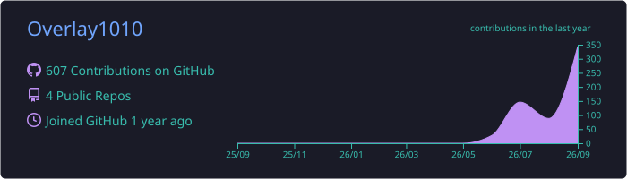
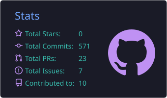
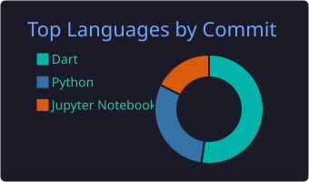

<!-- Header -->

  

  

  
  

---

### 🙋‍♂️ About Me

- 🤖 데이터와 AI로 **실제 문제를 푸는 서비스**를 만드는 걸 좋아해요
- 🔬 머신러닝 모델링부터 **LLM · RAG** 기반 애플리케이션까지 공부하고 있어요
- 🚀 모델을 노트북에서 끝내지 않고 **API와 앱으로 서비스화**하는 데 관심이 많아요
- 📫 Contact: overlay1010@gmail.com

---

### 🛠 Tech Stack

**Language & Data**

  
  
  
  

**Machine Learning & AI**

  
  
  
  
  

**Backend & Frontend**

  
  
  
  
  
  

**Infra & Tools**

  
  
  
  

---

### 📊 GitHub Stats

  

  
  

  

<!-- 🐍 잔디 먹는 뱀: .github/workflows/snake.yml 설정 후 주석 해제

  <picture>
    <source media="(prefers-color-scheme: dark)" srcset="https://raw.githubusercontent.com/Overlay1010/Overlay1010/output/github-snake-dark.svg" />
    
  </picture>

-->

<!-- Footer -->

